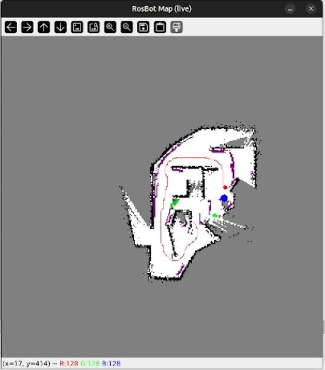
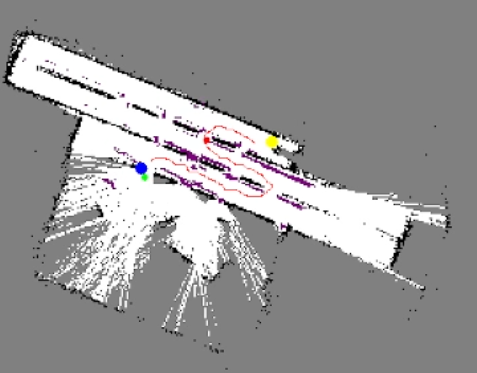
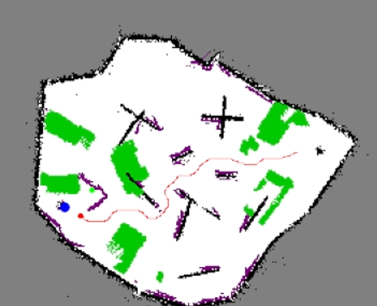
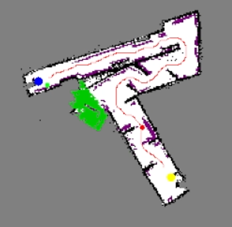
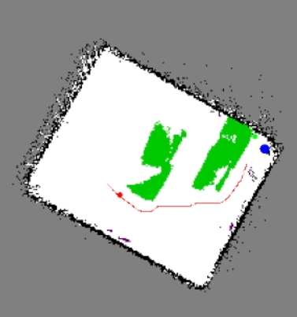

# Autonomous RosBot: Webots Maze Navigation

> **Accuracy note.** This README was written by reading the source. Where a claim
> comes from something other than code (a comment, an inference, a guess), it is
> marked. The repository's `CLAUDE.md` and `AGENTS.md` contain a "Current State"
> section that is **badly out of date** — it describes a keyboard-teleop baseline
> with "no odometry, mapping, perception, planning, or mission state machine yet."
> That has not been true for a long time. Do not trust those files; trust this one
> and the code.

---

## 1. Overview

This is a Webots controller that drives a Husarion RosBot through an unknown maze,
finds a **blue cylindrical pillar**, drives to it, then finds and drives to a
**yellow cylindrical pillar** — in that order — without ever driving over the
green "poison" ground patches, and without using the Webots Supervisor API or any
privileged simulator state.

The robot starts with no map. It builds one online from its lidar using a FastSLAM
2.0 particle filter, explores by picking frontiers between known-free and unknown
space, spots the pillars with HSV colour segmentation on the RGB camera, and drives
to them with A* global planning plus a Dynamic Window Approach local controller.

The problem it solves is the classic "autonomous exploration to a semantic goal"
loop, under the specific constraint that everything must be derived from onboard
sensors and must generalise across maze layouts (five are provided).

---

## 2. Architecture

There is **no ROS here.** No nodes, no topics, no messages, no `roslaunch`. It is a
single Webots controller process, written as a set of plain Python modules that
import each other directly and communicate through module-level state and function
calls. If you came expecting a ROS graph, recalibrate: the "nodes" below are Python
modules, and the "topics" are function calls.

### Module dependency and data flow

```
                      Webots simulator (robot.step)
                                 │
                         ┌───────▼────────┐
                         │   devices.py   │  the ONLY module that imports
                         │  (Robot, all   │  `controller` (Webots API).
                         │   device handles)   Everything else is pure Python.
                         └───────┬────────┘
                                 │
                         ┌───────▼────────┐
                         │   sensors.py   │  raw device reads → typed data:
                         │                │  wheel angles, IMU yaw, gyro_z,
                         │                │  lidar Nx2 body points, HSV colour
                         │                │  detections, green floor points,
                         │                │  overhead (floating-wall) points
                         └───┬─────────┬──┘
                             │         │
        ┌────────────────────▼──┐   ┌──▼──────────────────────────┐
        │   localization.py     │   │  main thread: green +       │
        │  encoder+IMU odometry │   │  overhead marking (~10 Hz)  │
        │  → (Δtrans, Δrot)     │   └──────────┬──────────────────┘
        │  + wheel-slip gate    │              │
        └────────┬──────────────┘              │
                 │ slam.predict(Δt, Δr)        │ mapping.mark_green()
                 │ (every control tick)        │ mapping.mark_overhead()
                 │                             │
        ┌────────▼─────────────────────────────▼──────────┐
        │                   slam.py                       │
        │  FastSLAM 2.0: 30 particles, each with its own  │
        │  log-odds map. predict() on the main thread;    │
        │  observe() on a BACKGROUND THREAD at ~10 Hz.    │
        │                     │                           │
        │                     ├──► pose_graph.py          │
        │                     │    keyframes, correlative │
        │                     │    scan-match loop closure│
        │                     │    least_squares optimise │
        │                     │    + full map rebuild     │
        └─────────────────────┼───────────────────────────┘
                              │ sync_from_log_odds(best particle)
                    ┌─────────▼──────────┐
                    │     mapping.py     │  canonical 300×300 uint8 grid
                    │  log-odds → cells  │  FREE/OCC/UNKNOWN/GREEN/CLOSED/
                    │  guarded by LOCK   │  BLUE/YELLOW.  Readers unlocked.
                    └─────────┬──────────┘
                              │ get_grid()
       ┌──────────────────────┼───────────────────────┐
       │                      │                       │
┌──────▼───────┐   ┌──────────▼─────────┐   ┌─────────▼────────┐
│ planning.py  │   │  exploration.py    │   │  following.py    │
│ A* + cv2     │   │  frontier detect,  │   │  DWA velocity    │
│ morphology + │   │  BFS cluster,      │   │  sampling, plus  │
│ inflation +  │◄──┤  score+select,     ├──►│  a step-wise     │
│ clearance    │   │  drive, recover,   │   │  path follower   │
│ cost + spline│   │  speed governor    │   │  (used only by Y)│
└──────┬───────┘   └──────────┬─────────┘   └─────────┬────────┘
       │                      │                       │
       └──────────────────────┼───────────────────────┘
                              │
                    ┌─────────▼──────────┐
                    │    mission.py      │  SEEKING_BLUE → SEEKING_YELLOW
                    │  blue-then-yellow  │  → DONE.  Uses perception.py for
                    │  state machine     │  world-frame target memory.
                    └─────────┬──────────┘
                              │
                    ┌─────────▼──────────┐
                    │     motion.py      │  drive_twist(v, ω)
                    │   + kinematics.py  │  diff-drive inverse kinematics,
                    └─────────┬──────────┘  wheel saturation clamp
                              │
                       four wheel motors
```

### Concurrency model

This matters, because it is unusual and it is the source of most of the code's
complexity:

- **One background daemon thread** (`slam.start_mapping_thread`, launched from
  `my_controller.py` before the main loop) calls `slam.observe()` at ~10 Hz,
  gated on `motion.is_turning()` being false.
- **The main thread** calls `slam.predict()` every control tick from
  `localization.update_from_encoders()`.
- They share `mapping.LOCK` (an `RLock`). `slam.observe()` deliberately holds the
  lock only around the short pose-update sections and runs the heavy per-particle
  `cv2.distanceTransform` and scan rasterisation **off-lock**, because holding it
  would stall `robot.step()`. The comments in `slam.py:114-130` explain this at
  length; it is a real design decision, not an accident.
- Grid readers (`mapping.get_grid`) run **unlocked**. The grid is only ever
  replaced by whole-array rebind, so a reader sees a complete but possibly
  one-cycle-stale array.

### Control-flow model: blocking sub-loops

`my_controller.py` has a conventional `while robot.step() != -1` loop for teleop.
But the two autonomous modes — `E` (explore) and `X` (mission) — are **blocking**:
`exploration.run()` and `mission.run()` call `devices.robot.step()` themselves
inside their own nested `while` loops and do not return until finished or aborted.

While they run, the main loop is suspended. Keyboard polling, live-map rendering,
and the stop condition are injected via a `should_continue()` callback that the
sub-loop polls every tick. This is a faithful port of the reference project's
structure (see §6), not an idiom I would recommend, but it is coherent and it
works.

---

## 3. Tech stack

| Thing | Value |
|---|---|
| Language | Python 3 only |
| Simulator | Webots **R2025a** (the `.wbt` header pins this) |
| Robot | Husarion **RosBot** (`Rosbot.proto`, pulled via `EXTERNPROTO` from the Webots R2025a GitHub tree) |
| Timestep | `WorldInfo {}` is empty, so Webots' default `basicTimeStep` of 32 ms applies |
| numpy | `>=2.0` |
| scipy | `>=1.11` (`splprep`/`splev`, `distance_transform_edt`, `least_squares`, `cKDTree`) |
| opencv-python | `>=4.8` (`inRange`, `moments`, `connectedComponentsWithStats`, `dilate`, `distanceTransform`, `imshow`) |
| Webots `controller` module | ships with Webots; not in `requirements.txt` |

There is **no build system**, no test framework, no linter config, no CI.

`controllers/my_controller/venv/` is a committed Python 3.13.2 venv containing only
`pip`. It is vestigial — the controller runs under Webots' own Python interpreter,
not this venv. There is no `.gitignore`, so `__pycache__/*.pyc`, `.DS_Store`, and
that venv are all tracked in git.

### Sensors used

All from the stock RosBot proto: four wheel motors (`fl/fr/rl/rr_wheel_joint`) with
encoders; `imu accelerometer`, `imu gyro`, `imu compass`, `imu inertial_unit`; four
short-range sensors (`fl/fr/rl/rr_range`); `camera rgb`; `camera depth`; `laser`
(with `enablePointCloud()`).

The accelerometer and compass are read in `sensors.read_sensor_snapshot()` for the
debug printout but are **not used by any control logic**. Only the inertial unit
(yaw) and the gyro (z-rate, for the slip gate) feed the estimator.

---

## 4. Repository layout

```
controllers/my_controller/     ← all real logic lives here
  my_controller.py    (445)  Webots entry point. Main loop, keyboard dispatch,
                             mode switching. Deliberately contains no sensor
                             math or navigation logic.
  devices.py           (95)  The only Webots import. Creates Robot(), fetches and
                             enables every device handle as a module global.
  sensors.py          (647)  Device reads → clean data. HSV colour detection,
                             pinhole ground projection of green pixels, per-pixel
                             projection of overhead/floating obstacles, lidar
                             point cloud, encoder/IMU scalars.
  kinematics.py        (58)  Diff-drive inverse kinematics + saturation clamp.
                             WHEEL_RADIUS_M=0.043, WHEEL_TRACK_M=0.18.
  motion.py            (48)  drive_twist(v, ω) → four motor velocities.
  localization.py     (183)  IMU-fused encoder odometry. Computes per-step
                             (Δtranslation, Δrotation) and feeds slam.predict().
                             get_pose() returns the SLAM estimate, not dead
                             reckoning. Includes a gyro-vs-encoder slip gate.
  slam.py             (475)  FastSLAM 2.0 particle filter + background thread.
  pose_graph.py       (241)  Keyframes, correlative scan-match loop closure,
                             least_squares pose-graph optimisation, map rebuild.
  mapping.py          (453)  Log-odds occupancy grid, Bresenham/DDA raycasting,
                             cell-code semantics, green/overhead/pillar stamping,
                             PNG dump (pure stdlib zlib+struct).
  perception.py       (129)  Pure geometry: body↔world transforms, and a
                             persistent per-colour world-frame target memory.
  planning.py         (260)  A* with clearance penalty + spline smoothing, over a
                             morphologically cleaned, inflated binary grid.
  following.py        (270)  DWA velocity sampling; plus a step-wise path
                             follower used ONLY by the manual `Y` key.
  exploration.py      (962)  Frontier detection/clustering/selection, the
                             blocking explore loop, recovery manoeuvres, the
                             live-lidar speed governor, the virtual bumper.
  mission.py          (501)  Blue-then-yellow state machine; pillar registration
                             gate; the final visual-servo approach.
  reactive.py         (138)  Laser 5-sector split + right-hand wall following.
                             Used only by autonomous.py.
  autonomous.py       (347)  LEGACY reactive wall-follower with its own, separate
                             mission FSM. Reachable only via the `G` key.
  safety.py           (138)  A safety-override layer that is NEVER IMPORTED.
                             Dead code. See §8.
  visualizer.py        (88)  Live cv2 map window. Degrades gracefully if the
                             OpenCV build is headless.
  sensor_debug.py     (277)  Console formatting for sensor snapshots.
  config.py           (340)  Every tunable constant, heavily commented.

worlds/Maze1..5.wbt        Five mazes. Each references controller "my_controller".
protos/Wall{Short,Medium,Long}.proto
                           Wall geometry protos that the worlds DO NOT USE — the
                           worlds inline raw `Solid { Box }` nodes instead. Dead.
.claude/specs/001-rosbot-navigation.md
                           The requirements spec (FR1–FR12).
.claude/commands/sdd-*.md  Slash commands enforcing a spec-driven workflow.
CLAUDE.md / AGENTS.md      Project instructions. AGENTS.md is a search-replaced
                           copy of CLAUDE.md (which mangled `.claude/commands/`
                           into `.Codex/commands/`). Both have a stale
                           "Current State" section and both point the spec at
                           `docs/specs/`, a directory that does not exist.
requirements.txt           numpy, scipy, opencv-python.
```

### What the worlds actually contain

Read from the `.wbt` files, not assumed:

- **Pillars**: `Solid` named `BlueCylinder` / `YellowCylinder`, radius 0.1 m.
  Height is 0.3 m in Maze1, 0.4 m in Maze2 and Maze3, and **unspecified** in Maze4
  and Maze5 (so Webots' `Cylinder` default height of 2 m applies, with the solid
  sunk to `z ≈ -0.6` so only ~0.4 m protrudes).
- **Green forbidden ground**: `Solid` nodes named `Poison`, `Poison(1)`, … — flat
  green boxes (e.g. `0.4 × 0.5 × 0.1` at `z = -0.04`, so the top sits ~flush with
  the floor). Counts: Maze1 ×1, Maze2 ×2, Maze3 ×8, Maze4 ×1, Maze5 ×2.
- **Floating walls**: ordinary wall boxes translated upward, e.g. Maze1's
  `WallMedium(3)` at `z = 0.45` and `WallMedium(5)` at `z = 0.5` (box height
  0.5 m, so their undersides sit at 0.20 m / 0.25 m). These are above the lidar's
  scan plane, which is exactly why the depth-camera overhead-marking path exists.

---

## 5. How it runs

There is nothing to build.

```bash
# 1. Install the three third-party deps into the interpreter Webots uses.
#    (Not the committed controllers/my_controller/venv — that one is unused.)
python -m pip install -r requirements.txt

# 2. Open a world in Webots R2025a:
#      worlds/Maze1.wbt   (…through Maze5.wbt)
#
# 3. Webots auto-launches controllers/my_controller/my_controller.py.
#
# 4. Click the 3D view to give it keyboard focus, then press a key.
```

To re-run after a code change: reset the simulation (`Ctrl+Shift+T`).

### Keys

| Key | Effect |
|---|---|
| `X` | **The main event.** Run the blue-then-yellow mission. Blocking. `X` or `Space` stops it. |
| `E` | Pure frontier exploration, no mission. Blocking. `E` or `Space` stops it. |
| `G` | Toggle the legacy reactive wall-follower (`autonomous.py`). |
| `Y` | Follow the last planned path with the step-wise DWA follower. |
| `B` | Capture the robot's current cell as a planning goal (press twice for an A→B pair). |
| `V` | Plan from robot (or A) to the goal; writes `path.png`. |
| `C` | Toggle the live OpenCV map window. |
| `F`/`S`/`A`/`D` | Teleop: forward / back / rotate left / rotate right. |
| `Space` | Hard stop; exits autonomous/follow mode. |
| `I` | Print a full sensor snapshot. |
| `L` | Toggle periodic sensor logging. |
| `O` | Print the current pose. |
| `M` | Print a map summary and write `map.png`. |
| `P` | Print blue/yellow bearings, distances, and world positions. |
| `T` | **Advertised in the startup banner, but dead.** `test_timer` is initialised to 0 and never assigned a nonzero value anywhere, so the 2-second motor self-test can never fire. |

Both `E` and `X` call `localization.reset_pose()` and `mapping.clear()` on entry,
so every run starts from a fresh SLAM system with the pose origin at wherever the
robot currently is. The world frame is therefore **robot-start-relative**, always.

### Configuration

Everything tunable is in `config.py`. Nothing is read from the environment; there
are no command-line arguments (`controllerArgs` in the worlds is `[""]`).

Two flags produce very heavy console output and are currently **on**:
`mission._MISSION_DEBUG = True` and `exploration._NAV_DEBUG = True`. Both are
explicitly labelled "TEMPORARY" / "instrumentation only" in their own comments.
`reactive.wall_follow_twist` also unconditionally prints an `[REACTIVE] open side:`
line on every call.

---

## 6. Algorithms and methods

Substantial parts of this stack are described in the source as a **port of an
external reference project** ("AURE", attributed in docstrings to *Hieu Tran et
al.*). `slam.py`, `pose_graph.py`, `planning.py`, `following.py`, and
`exploration.py` all say so explicitly, and several constants in `config.py` are
annotated "verbatim from the reference CONSTANTS.py". The docstrings also record
what was deliberately **not** ported — notably the reference's red-wall dead-end
closure, rejected as maze-specific and therefore a violation of the generalisation
constraint. I have not seen the reference; I am reporting what the code claims.

### Kinematics (`kinematics.py`)

The four-wheel skid-steer RosBot is approximated as a differential drive:
`ω_left = (v − ω·L/2)/r`, `ω_right = (v + ω·L/2)/r`, with `r = 0.043 m`,
`L = 0.18 m`. `clamp_twist` scales `v` and `ω` down *uniformly* when a wheel would
saturate, preserving the arc shape rather than distorting it.

### Localization (`localization.py`)

Heading comes straight from the inertial unit (minus a baseline captured at reset),
which is drift-free in simulation. Position is midpoint-integrated from wheel
encoder deltas: `x += d_s·cos(θ_mid)`, `y += d_s·sin(θ_mid)`.

There is a **rotational wheel-slip gate**: if the encoder differential claims a turn
(`|Δθ_enc| > 0.01 rad/step`) but the gyro says the body is not rotating
(`|gyro_z| < 0.05 rad/s`), the wheels are spinning in place, so the translation
update is suppressed and `slam.predict(0.0, Δθ)` is called instead.

Note the layering: `localization`'s own `_x/_y/_θ` are only a diagnostic dead-
reckoning trace. `get_pose()` returns `slam.estimated_pose()` — the weighted mean of
the particle cloud.

### SLAM (`slam.py`, `pose_graph.py`)

**FastSLAM 2.0** with 30 particles. Each particle carries its own full
300×300 float32 log-odds map.

- *Motion update* (`predict`, every 32 ms tick): sample-based odometry motion
  model with noise `α₁..α₄ = 0.02, 0.02, 0.05, 0.01`.
- *Measurement update* (`observe`, background thread, ~10 Hz, gated on not-turning
  **and** on having accumulated ≥3 cm of translation or ≥3° of rotation since the
  last update — "update on motion, not on a clock"):
  1. Downsample the scan to 45 beams.
  2. For each particle, build a likelihood field (`cv2.distanceTransform` over its
     own map's obstacle cells).
  3. **Improved proposal**: refine each particle's pose with a small correlative
     search (±2 px, ±6° in 2° steps) against its *own* map. This is the defining
     move of FastSLAM 2.0 versus 1.0, and it is what keeps each particle's map
     crisp.
  4. Use the refined pose's residual log-likelihood (Gaussian, σ = 0.08 m) directly
     as the importance weight.
  5. Systematic resampling when `N_eff < 0.5·N`.
  6. Rasterise the scan into every surviving particle's map (vectorised DDA, which
     the comments note is ~50× faster than the per-beam Bresenham loop and releases
     the GIL).
  7. Publish the map of the particle *nearest the weighted-mean pose* — not the
     argmax-weight particle, because after refinement the weights are near-equal
     and argmax flickers between spatially different particles.

**Loop closure** (`pose_graph.py`): keyframes every 0.15 m or 15°. For a new
keyframe, candidates within 0.6 m and at least 15 keyframes old are scored by a
coarse correlative scan match (±0.3 m, ±20°) using a `cKDTree` mean
nearest-neighbour distance. If the best score beats 0.06 m, a loop edge is added,
`scipy.optimize.least_squares` (soft-L1, first node anchored) optimises the graph,
the whole log-odds map is rebuilt by re-rasterising every keyframe scan at its
corrected pose, and the particle cloud is rigidly re-anchored.

Two throttles were added on top of the reference, both for performance, both
documented as such: `LOOP_CLOSURE_COOLDOWN_KEYFRAMES = 20` (the O(keyframes) map
rebuild becomes an O(keyframes²) runaway if it fires every frame) and
`LOOP_CLOSURE_ATTEMPT_INTERVAL = 8` (even a *failed* attempt runs the full
candidate search, whose cost grows unboundedly as the map fills).

### Mapping (`mapping.py`)

A 300×300 grid at 0.0333 m/cell = **10 m × 10 m**, origin at the grid centre,
indexed `[row = map_y, col = map_x]` with the y-axis flipped.

Log-odds accumulation: `LOGODDS_FREE = −0.36` along each ray, `LOGODDS_OCC = +0.85`
at the endpoint, clipped to ±5.0. Cells at or above `LOGODDS_LOCK = 3.5` are
**sticky**: free updates skip them, so a confirmed wall is never eroded.
Thresholded through a sigmoid into discrete codes: `P > 0.7 → OCC`, `P < 0.5 →
FREE`, untouched → `UNKNOWN`.

Beyond lidar, three semantic marks are stamped and then **protected from sensor
overwrite**:

- `CELL_GREEN` (190) — green floor pixels, inverse-pinhole projected onto the floor
  plane assuming a camera height of 0.17 m, only from the bottom half of the image,
  only within 1.2 m.
- `CELL_CLOSED` (200) — floating/overhead walls. The depth camera's upper band is
  projected per-pixel (each pixel keeps its own bearing, decomposed through the
  full pinhole ray), then **height-gated**: only points whose recovered real-world
  height is ≤ 0.20 m are kept, because a wall high enough to drive under should not
  be marked.
- `CELL_BLUE` (100) / `CELL_YELLOW` (150) — pillar cells, once confirmed.

There is a genuinely clever cross-check here, in `_grid_from_log_odds` and
`mark_overhead`: lidar physically *cannot* see a real floating wall, since it sits
outside the scan plane. So if lidar log-odds independently confirm occupancy at a
`CELL_CLOSED` cell, that cell was never a floating wall — it is an ordinary
floor-to-ceiling wall the overhead band happened to clip — and lidar is allowed to
demote it to a normal `CELL_OCC`. A true floating wall's footprint stays FREE under
lidar and so is never demoted.

### Perception (`sensors.py`, `perception.py`)

HSV segmentation via `cv2.inRange` with fixed bands (blue `H∈[100,140]`, yellow
`H∈[20,35]`, green `H∈[36,86]`). Bearing comes from the mask centroid
(`cv2.moments`) mapped through the camera FOV. Green is trusted only below the
image midline and only above an 8% area ratio.

Range to a pillar is estimated the reference's way (`_estimate_column_distance_cm`):
take the *far* depth over the colour mask, then subtract a known vertical leg via
Pythagoras. **`COLUMN_HEIGHT_CM` is set to 125.0 cm — and no pillar in any of the
five worlds is anywhere near that tall** (they are 0.3–0.4 m of protruding
cylinder). This is almost certainly an unadjusted leftover from the reference
project's world. The code has independently discovered the consequence and
documented it in `config.py:330-337`: the depth distance "badly UNDER-estimates far
pillars (a ~5 m pillar read as 1.49 m)". Consequently the depth range is used
**only to steer toward a pillar**, never to confirm arrival.

`perception.py` holds a persistent world-frame memory of the last sighting of each
colour, projected through the current pose. This is what lets the robot drive back
to a yellow pillar it merely glimpsed while hunting blue.

### Exploration (`exploration.py`)

Frontier-based. Frontier cells are FREE cells 4-adjacent to UNKNOWN, found
vectorised, then BFS-clustered (8-connected, minimum 15 cells).

Selection scores each cluster `utility = size / (distance + 15)`, skipping clusters
that are too small, too close, or within 30 px of an already-visited centroid.
Two refinements over the reference are called out in comments:

- **Self-exclusion ring** (`FRONTIER_SELF_EXCLUDE_PX = 12`): the disk directly under
  the robot never gets cleared (it is below the lidar's minimum range), so its
  boundary is a phantom frontier that *moves with the robot* and can never be
  resolved. Selecting it traps exploration in place. Those cells are dropped from
  candidacy entirely.
- **Selection every iteration**, not every 5th after a 50-iteration warm-up as the
  reference did. With the old cadence, ~4 of every 5 drives fell back to a random
  already-explored free cell.

When the mission has sighted a pillar, `set_target_bias()` multiplies each cluster's
utility by `1 + 2.0·alignment`, where alignment is the clamped cosine between the
robot→goal and robot→pillar directions. Exploration keeps mapping but leans toward
the target.

Fallback chain when no frontier yields a path: a random nearby free cell (biased to
the nearest-to-pillar sample when a bias is set) → rotate in place to reveal new
space, periodically clearing the visited blacklist.

### Path planning (`planning.py`)

Per inflation level in `[4, 3, 2]` px:

1. Promote `CELL_CLOSED` and `CELL_GREEN` to `CELL_OCC` so they receive the same
   dilation margin as real walls.
2. `cv2.connectedComponentsWithStats` to drop obstacle blobs under 6 px, then
   single-pixel noise.
3. `cv2.dilate` with an elliptical kernel.
4. Optionally block UNKNOWN (`PLAN_BLOCK_UNKNOWN = True` for goal runs; `False` for
   frontier chasing and for the blue→yellow traceback, where routing through
   never-mapped cells is the whole point).
5. Punch a free disk of radius 3 px around start and goal so inflation cannot bury
   the endpoints.
6. **A\***: 8-connected with 2-px steps, heuristic weighted ×1.2, plus a clearance
   penalty `2.0·(1 − d_obs/5)` from `distance_transform_edt` that pushes routes
   toward corridor centres.
7. B-spline smooth (`splprep`/`splev`), de-duplicated back to integer cells.

The first level yielding a path of at least 0.8 m wins; otherwise the longest
candidate found is returned. Escalating *down* to inflation 2 is what lets it thread
genuinely narrow passages.

### Local control (`following.py`)

**Dynamic Window Approach.** Samples `v ∈ {0.1 … 0.35} m/s` × `ω ∈ {0, ±2, ±2.5,
±3, ±3.5, ±4.5} rad/s`, rolls each forward 10 steps (~320 ms), rejects any rollout
leaving the map or entering a cell with clearance < 1.0, and scores survivors:

```
score = 4.0·heading + 3.5·distance_progress + 0.5·speed + 2.0·clearance
        − 3.5·max(0, 3.5 − endpoint_clearance)      [body-clip penalty]
```

Two details worth knowing. First, there is **no `v = 0` sample**, so the robot never
pivots in place under DWA — it always creeps-and-steers, which is what keeps motion
smooth. Second, the body-clip penalty is applied to the **endpoint** clearance, not
the rollout minimum. The comment explains why, and it is correct: the first rollout
step is always at the robot's current position, so a min-over-rollout penalty is
pinned by where the robot already *is* and is identical for every ω — no steering
gradient. Endpoint clearance does vary with ω, so penalising it makes DWA curve back
toward the corridor centre. It is a soft penalty, not a reject, so a uniformly tight
corridor still yields the least-bad move rather than a stuck refusal.

### Safety, as actually wired

This is the part most likely to be misread, so, concretely — during the `X` mission
and `E` exploration, obstacle safety comes from exactly three mechanisms, all in
`exploration.py`:

1. **Live-lidar speed governor** (`_govern_speed`): scales commanded forward speed
   linearly by front-lidar clearance, full above 0.45 m, zero at 0.15 m, over a ±25°
   cone. This exists because DWA only avoids *mapped* obstacles, so in unknown space
   it would otherwise charge unmapped walls at full speed. Angular velocity is never
   governed, so the robot can still rotate toward an opening while braked.
2. **Virtual bumper** (`_obstacle_in_front`): front range sensors < 0.05 m, or
   lidar min over ±35° < 0.10 m.
3. **Recovery manoeuvres**: reverse-and-turn, with a rear-blocked guard that
   pivots toward the more-open side instead of reversing into the wall behind, and
   an escalation that adds a turn after 2 consecutive failed recoveries so the
   replan does not drive back in at the same angle.

**Green avoidance in mission mode is purely map-mediated.** Green pixels get stamped
as `CELL_GREEN`, which the planner promotes to an obstacle and which DWA's distance
field treats as an obstacle. There is no reactive "green ahead, stop" reflex on this
path. `safety.py` implements exactly such a reflex — and is never imported (§8).

### Mission (`mission.py`)

`SEEKING_BLUE → SEEKING_YELLOW → DONE`. Per phase: if the pillar's position is
unknown, explore (biased toward it once glimpsed) until *committed*; then drive to
it precisely.

The design is deliberate and well-argued in its own docstring: yellow glimpsed while
seeking blue is remembered for free, so the yellow phase is a direct traceback rather
than a re-exploration. This beats a "find both, then backtrack to blue" scheme, which
would cross the blue↔yellow gap twice.

Two gates carry the load:

- **Commit** (`_should_commit`): stop biased exploration and hand off to the final
  drive once the pillar is confirmed at contact range, *or* the robot is within
  1.0 m of the remembered sighting. Committing from a far, depth-noisy glimpse
  caused arrive-at-wrong-spot retries.
- **Registration** (`_within_mark_dist`): a pillar is only marked as reached when
  either its mask fills ≥30% of the frame, *or* the front lidar reads < 0.35 m while
  the pillar is centred within 0.25 rad. Depth distance is explicitly excluded here,
  for the `COLUMN_HEIGHT_CM` reason above.

The final approach is a **visual servo**, not path following: when the pillar is in
sight and nothing trips the bumper, `_drive_to` abandons the A* path and drives
straight at the bearing (rotate to centre, then creep). The A* path exists only to
bring the pillar into view. Recovery from a local wedge escalates in tiers: retry the
same waypoint (≤2), rejoin the nearest remaining waypoint (≤4, and only here test
whether the route is genuinely blocked), then global replan.

---

## 7. Results and evaluation

**The evidence here is qualitative, not measured.** There is no test suite, no
benchmark harness, no evaluation script, no CI, and no recorded timings, success
rates, or trajectory logs. What does exist is one occupancy-grid capture per maze,
committed under `pics/`. They are screenshots, not data — but they are real output
from real runs, and they show the system doing what §6 claims.

### One run per maze

Each image is the live map from `visualizer.py` (the `C` key). Read them with the
colour key: **white** = mapped free, **black** = lidar-seen wall (`CELL_OCC`),
**grey** = unknown, **green** = forbidden ground (`CELL_GREEN`), **purple** =
floating wall marked from the depth camera (`CELL_CLOSED`), **blue/yellow dots** =
registered pillars, **red line** = the planned A\* route, **red dot** = the robot.

| Maze 1 | Maze 2 |
|---|---|
|  |  |
| The raw cv2 window, chrome included. Blue pillar registered; a long route loops the maze. | Blue **and** yellow both registered — a completed mission. Note the radial white streaks, which are lidar rays fanning through a doorway. |

| Maze 3 | Maze 4 |
|---|---|
|  |  |
| Eight separate green patches, matching the eight `Poison` solids in `Maze3.wbt`. The route threads between them. | Blue **and** yellow both registered. One large green region the route steers around. |

| Maze 5 |
|---|
|  |
| Two green patches, matching the two `Poison` solids in `Maze5.wbt`. Sparse maze, mostly open floor. |

`pics/` also holds a `Maze_N_Map.png` for each maze — the same grid without the
window chrome. Only one image per maze is shown above.

### What these images do and do not prove

They *do* corroborate several claims independently of the code:

- The green count in the captures matches the `Poison` solid count I read out of
  each `.wbt` (Maze3 → 8, Maze5 → 2, Maze4 → 1). Green-ground detection and
  projection are genuinely working.
- Purple `CELL_CLOSED` cells appear, so the depth-camera floating-wall path fires
  in practice, not just in theory.
- **Maze 2 and Maze 4 show both a blue and a yellow pillar stamped.** Registration
  only happens at contact range (§6), so those two runs reached both pillars in
  order. That is the mission's success condition, visible.
- Maze 1, 3, and 5 show **only the blue pillar**. Whether those runs were stopped
  early, or failed to reach yellow, is not recoverable from a still image. I am not
  going to guess.

They *do not* establish: how long any run took, whether it was reproducible (it
isn't — see §9 on unseeded RNG), how many attempts preceded the capture, or whether
the robot ever touched green. A top-down grid cannot show a wheel crossing a cell.

The remaining evidence is **git commit messages** — e.g. `947963b "navigaton thorugh
4 maze is now good and also solve simtime droping of goal state"` and `d6e4108
"improved the obstacle avoidance in maze 4"`. That is weak: unversioned,
unquantified, and the author's own claim. It does suggest cross-maze testing
genuinely happened.

Per `CLAUDE.md`, validation is manual by construction: "every milestone must be
observable in Webots (logs to the Webots console, robot behavior in the 3D view)."

If you need numbers, you will have to generate them. The instrumentation is largely
present already (`_MISSION_DEBUG`, `_NAV_DEBUG`, `[POSE]` logging, `robot.getTime()`
in `mission.py`); what is missing is a harness that runs the five worlds headless and
aggregates. Nothing in this README should be read as measured.

---

## 8. Status: what works, what does not

### Implemented and (per the author's commits) working end-to-end

The `X` mission path: device init → odometry → FastSLAM → occupancy grid → HSV
pillar detection → biased frontier exploration → commit → A* + DWA drive → visual
servo → registration → blue-then-yellow sequencing → `DONE`. Every layer of the
syllabus build order in `CLAUDE.md` has a real implementation behind it, and the
modules are properly decoupled (only `devices.py` touches Webots; everything else
is testable in principle from pure Python).

### Implemented but not exercised by the main path

- **`following.step()`** — the step-wise path follower with its own progress
  watchdog and recovery. Only the manual `Y` key uses it. The mission and
  exploration use `exploration._follow_local_target()` instead, which calls
  `following.dwa_velocity()` directly and implements its own stuck detection. Two
  parallel followers with two different stuck heuristics.
- **`autonomous.py` + `reactive.py`** — a complete second mission state machine
  (`SEEKING_BLUE`/`SEEKING_YELLOW`/`DONE`) built on right-hand wall following, with
  its own inline green/front/rear safety overrides. It shares no state with
  `mission.py`. Reachable only via `G`. This is legacy; the two FSMs will disagree.

### Dead code — implemented, never invoked

- **`safety.py`.** 138 lines implementing exactly the safety-override layer the
  spec asks for (front collision with latched escape, rear collision, green
  stop/slow/turn). `grep -rn safety` finds no `import safety` anywhere. Its
  docstring claims it is "applied to EVERY autonomous twist … right before it
  reaches the motors." It is not applied to any twist.
- **The `T` self-test key.** Advertised in the startup banner and the module
  docstring. `test_timer` is never assigned a nonzero value.
- **`reset_this_step`** in `my_controller.py`. Initialised to `False` at line 77,
  read at lines 91 and 102, and only ever set `True` at line 146 — *after* both
  reads. The guard is always true; the variable does nothing.
- **`protos/Wall*.proto`.** The worlds inline raw `Solid { Box }` nodes and never
  instantiate these protos.
- **Unused config constants**: `MAP_UPDATE_PERIOD_STEPS`, `MAP_UPDATE_MAX_OMEGA`,
  `MAP_LIDAR_MAX_RANGE_M`, `RECOVERY_REVERSE_TICKS`, `RECOVERY_TURN_TICKS`,
  `FOLLOW_ALIGN_RAD`, `FOLLOW_ALIGN_OMEGA`, `EXPLORATION_START_FRONTIER_AFTER`,
  `EXPLORATION_FRONTIER_SELECTION_FREQ`, `FOLLOW_STUCK_MOVE_M`,
  `FOLLOW_STUCK_STEPS`, `FOLLOW_PROGRESS_WINDOW`. Several have long explanatory
  comments describing behaviour that no longer exists.
  `MAP_LIDAR_MAX_RANGE_M = 3.5` is worth singling out: its comment says "ignore
  lidar points beyond this (far rays smear the map)", but
  `sensors.read_lidar_pointcloud_2d()` applies **no distance cap at all** and says
  so in its own comment. The two comments contradict each other; the code follows
  the second.

### Debug instrumentation left on

`mission._MISSION_DEBUG = True` and `exploration._NAV_DEBUG = True`, both
self-labelled "TEMPORARY" and tied to a specific past investigation ("Phase 1", "the
stuck corridor loop"). `reactive.wall_follow_twist` prints unconditionally on every
call. Expect a very noisy Webots console.

### Stale documentation inside the code

- `slam.py`'s docstring says "Not wired into the control loop yet (that is a later
  milestone)." It is wired in; `localization.get_pose()` returns the SLAM estimate.
- `config.py:23` says `OVERHEAD_MARK_ENABLED` is "TEMP: A/B test — disabled to
  isolate whether depth-based CELL_CLOSED marking is causing the replan/reverse
  thrash. Re-enable once confirmed." The value on that line is `True`.
- `config.py:121-122` calls `CELL_CLOSED` and `CELL_GREEN` "reserved — later
  milestone". Both are fully used.

### Not implemented

Nothing in the spec's FR1–FR12 is missing outright. FR6 (green avoidance) is the
weakest: it is satisfied structurally (green becomes a map obstacle) rather than
reactively, and the reactive component that would back it up is the dead
`safety.py`.

---

## 9. Known limitations and open issues

**Green ground can plausibly be driven over during the final visual approach.**
*(Inference, from reading `mission._drive_to`.)* When the pillar is visible and
`_obstacle_in_front()` is false, the code `continue`s straight to a bearing-servo
that ignores the occupancy grid entirely. `_obstacle_in_front()` consults only the
range sensors and lidar — neither of which sees green paint. So if a green patch
lies between the robot and a visible pillar, nothing in that code path stops it.
The map knows; the visual servo does not ask. I have not observed this happen; I am
reporting that the guard is absent.

**Green marking is narrow and fragile.** Only the bottom half of the RGB frame,
only within 1.2 m, only ≥60 green pixels, only every 3rd tick, and only while not
turning. It also assumes a camera height of 0.17 m and a forward offset of 0.03 m,
both annotated "tune per robot" in `config.py` — i.e. **not verified against the
actual RosBot proto.** A wrong camera height biases every projected green cell.
The same 0.17 m is assumed independently for the overhead projection.

**`COLUMN_HEIGHT_CM = 125.0` matches no world in this repo.** The pillars protrude
0.3–0.4 m. The Pythagoras subtraction in `_estimate_column_distance_cm` is therefore
operating on a vertical leg that is 3–4× the true one. The code compensates by
distrusting the output (using it for bearing/direction only), which works, but it
means the "distance to pillar" printed by the `P` key and stored in target memory is
not a distance in any meaningful sense. Anyone tuning `PILLAR_COMMIT_DIST_M` should
know that the memory position it is measured against was projected using this
number.

**The map is 10 m × 10 m, centred on the robot's start pose.** Maze2 spans roughly
`y ∈ [0.4, 4.5]` in world coordinates, so it fits — but there is no bounds checking
that would tell you if a larger maze silently ran off the grid.
`mapping.there_is_obstacle()` treats out-of-bounds as blocked, which fails safe, but
`world_to_map` will happily return out-of-range indices to other callers.

**Two mission state machines that cannot agree.** `autonomous._mission_state` and
`mission._state` are independent globals. Pressing `G` and then `X` (or `R`, which
resets one via `reset_mission_state()` and the other via `mission.reset()`) exercises
both. Nothing keeps them consistent.

**The blocking sub-loops swallow the main loop.** While `mission.run()` or
`exploration.run()` executes, the main `while robot.step()` loop is suspended and
only the `should_continue()` callback runs. Any behaviour a reader expects from the
main loop — the periodic `[POSE]` log, the `viz_on` render at
`VIZ_PERIOD_STEPS` — is not happening during a mission; the callback re-implements
the render. The `G`-mode autonomous step, by contrast, runs in the main loop.
Two different execution models in one file.

**Loop closure is throttled for performance, not for correctness.** The cooldown and
attempt-interval constants exist because the O(keyframes) map rebuild and the growing
candidate search were freezing the simulation. Both are documented as *not* in the
reference. A genuine revisit occurring during a cooldown window will simply not be
closed.

**Resampling deep-copies 30 × 300 × 300 float32 maps** (`_resample`, via
`log_odds.copy()`) — about 10.8 MB per resample event. It runs on the background
thread, but it is not free, and it is proportional to particle count.

**Determinism.** `exploration` uses the `random` module (unseeded) for recovery turn
directions and durations, frontier fallback sampling, and jittered centroids;
`slam.predict` draws unseeded `np.random.normal` noise. Runs are not reproducible.
Debugging a specific failure requires seeding both.
